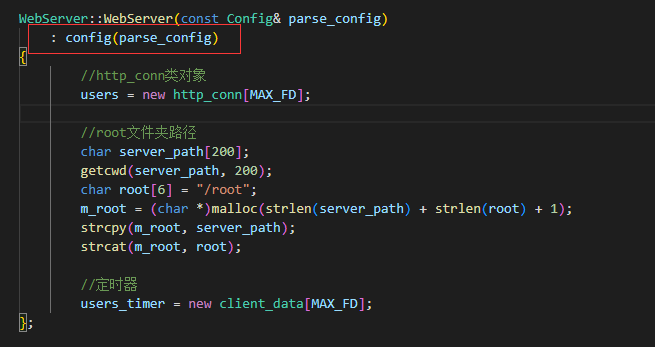

TinyWebServer魔改日记

# TinyWebServer简介

TinyWebServer是github上 9.1k start的C++轻量级Web服务器。

[github传送门](https://github.com/qinguoyi/TinyWebServer)

适用于入门学习web服务器实践网络编程，技术栈涉及以下几点：
- 使用 线程池 + 非阻塞socket + epoll(ET和LT均实现) + 事件处理(Reactor和模拟Proactor均实现) 的并发模型
- 使用状态机解析HTTP请求报文，支持解析GET和POST请求
- 
- 实现同步/异步日志系统，记录服务器运行状态访问服务器数据库实现web端用户注册、登录功能，可以请求服务器图片和视频文件

# 个人输出
由于TinyWebServer仅是入门学习，非成熟商业项目，重点内容主要对于从0-1的http解析、epoll的实现。

代码质量并不高，阅读代码过程中发现许多问题，尝试基于个人经验对于TinyWebServer进行编译优化、代码重构。

> 查看commit web进行review。

## 使用docker打包编译环境
  
在build.sh中增加编译docker,打包编译环境。

通过docker可以帮助其他开发者快速搭建相同编译环境，并且配置了ccache，提高编译速度。

[commit web](https://github.com/wentizongbibanfaduo/TinyWebServer-modify/commit/e0c1a0b3c0b3f5c149f5823b7bcf74874ed7f338)

    

## 使用cmake代替makefile
  
  cmake对于后期维护管理编译更为便捷。
  
  [commit web](https://github.com/wentizongbibanfaduo/TinyWebServer-modify/commit/de2687806a15059d85017e78004446a9b7028968)

## 优化读取config配置

   - 将config放在server类中
  
      原始代码中，server内部重新定义了一份config中的变量,变量冗余且函数参数过多。

      并且变量命名不规范，各种命名方式都有。
      

      

      对此进行优化:

      除去server init 方法，将config变为server内部变量，同时规范命名，统一使用下划线。

      

      >* Effective c++中使用初始化队列，可以在变量定义的时候就初始化，对比放在函数内少一次赋值操作。
      >* Effective c++中多使用const 关键词，编译器会对const 修饰变量进行优化。

      [commit-web](https://github.com/wentizongbibanfaduo/TinyWebServer-modify/commit/b0ed4ebaab25a6063d0b5088e0bdb7589879375a)

   - 规范变量命名

      [commit-web](https://github.com/wentizongbibanfaduo/TinyWebServer-modify/commit/9de73356b9f35cc1010a494b704848919da31088)

   - 将config变量设为private 提供set/get方法修改访问

      [commit-web](https://github.com/wentizongbibanfaduo/TinyWebServer-modify/commit/332011f96fbec294db0be2f4daf4d48901411b68)
      
   - 配置trig移动到config中
  
      对于main函数中单独的trig的初始化很奇怪。

      

      

      这本应是在读取config阶段就初始化好，对此移动函数至config的 parse_config中。
      
      [commit-web](https://github.com/wentizongbibanfaduo/TinyWebServer-modify/commit/504666102c5188d727f8a34c91af857d0ddf3a26)

##  宏定义多条语句使用do{}while(0)
宏定义多条语句应使用do{}while(0)，以预防编译预处理中的替换宏导致的bug。

## 使用卫语句优化代码
   - 多使用卫语句，减少嵌套结构更清晰。
  
   修改前

   

   修改后

   

   - 重复代码提炼函数。
  
   [commit-web](https://github.com/wentizongbibanfaduo/TinyWebServer-modify/commit/c89f566636779a5ff034136ab6bb1640e4518279)

